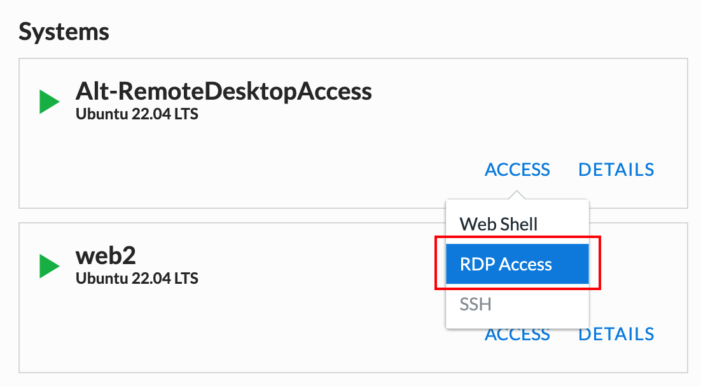
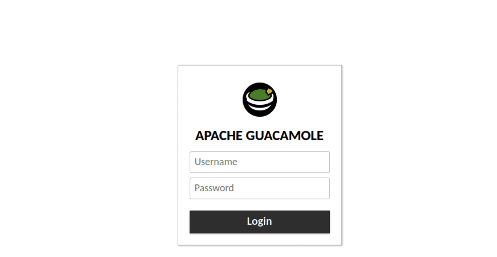

Introduction
============

The purpose of this Lab is to introduce NGINX Plus. NGINX Plus brings you
everything you love about NGINX Open Source, adding enterprise-grade features
like high availability, active health checks, DNS system discovery, session
persistence, and a RESTful API. NGINX Plus is a cloud-native, easy-to-use
reverse proxy, load balancer, and API gateway. Whether you need to integrate
advanced monitoring, strengthen security controls, or orchestrate Kubernetes
containers, NGINX Plus delivers with the five-star support you expect from NGINX.

In this lab we will explore a few of the capabilities listed above.

Background
-----------

`NGINX <https://nginx.org/en>`__ and `NGINX 
Plus <https://www.nginx.com/products/nginx>`__ itself uses a native 
configuration lanugage ("NCL") that leverages the linux flat file 
and directory structure.  A main `nginx.conf` file will have 
multiple includes that typically will be in directories.  This allows 
shared configurations and isolation for individual instances. NGINX 
can also be deployed on many different form factors and integrates 
well into CI/CD pipelines.

NGINX has become a very popular application and is the most used web server 
on the internet today!

Getting Started
----------------

The infrastructure is pre-built in UDF for your use and includes the following
components:

    - NGINX Plus Instance
    - NGINX Open Source Instances
    - Windows JumpHost

The Jumphost (Windows) is already setup with all the tools required to complete
the lab. **Run all lab activities from the JumpHost**. When using the web Browser
on the JumpHost be sure to use Chrome. In the interest of time, the NGINX Plus
image creation and deployment process has already been completed for you.

Accessing the Lab
-----------------

In this lab, you will need access all resources by connecting to a Linux jump host (Called **JumpHost**) running RDP. However, some environments will restrict RDP access (Port 389). To overcome this restriction we have added another VM called **Alt-RemoteDesktopAccess**. This VM is running Apache Guacamole, which enables us to access **Jumphost** VM running RDP using HTTPS. 

On the Alt-RemoteDesktopAccess VM tile, click **ACCESS** and then click **GUACAMOLE**. 

On the **GUACAMOLE** login prompt use the following credentials Username: user Password: user.

The Windows JumpHost is now ready for the lab

.. image:: images/lab_desktop.png

